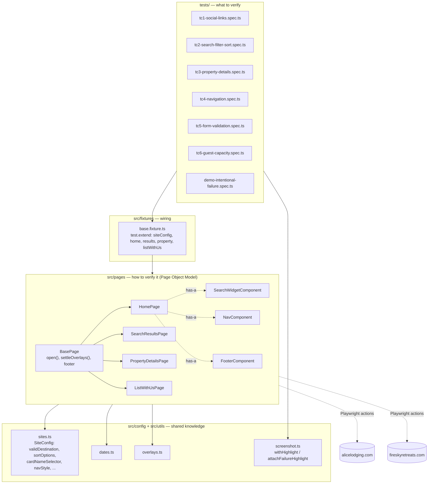
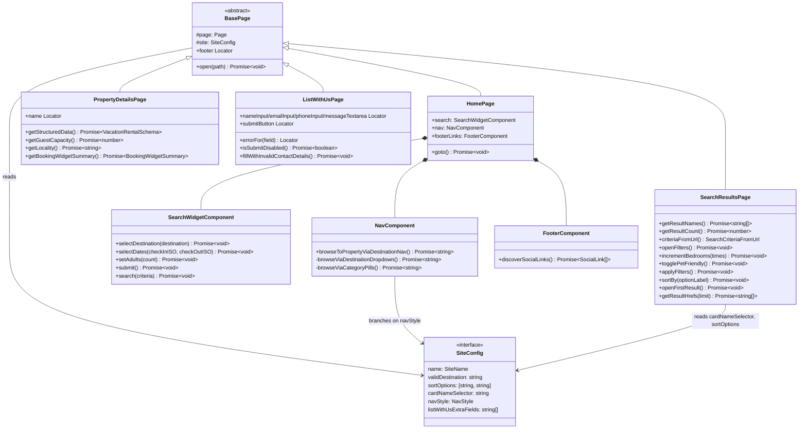
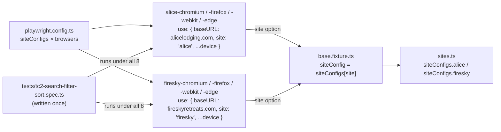
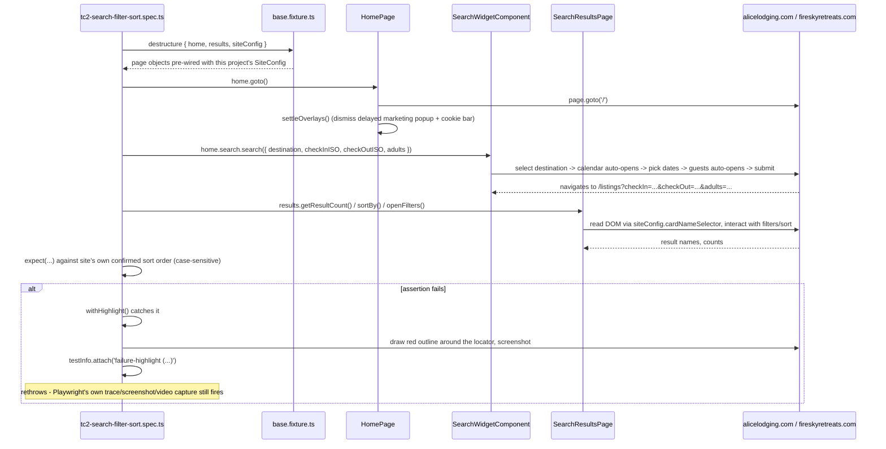
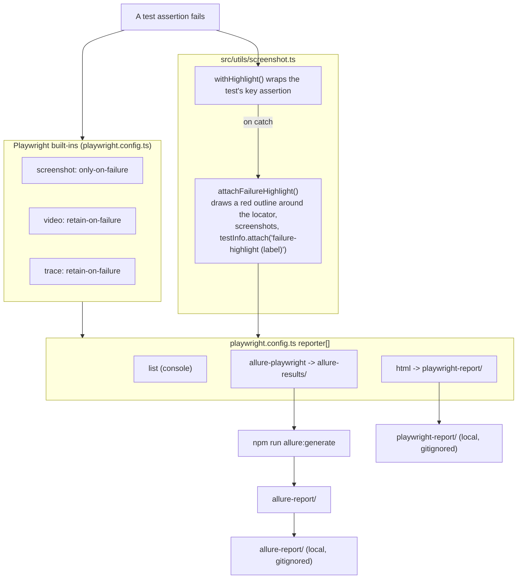
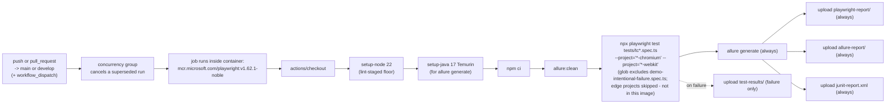
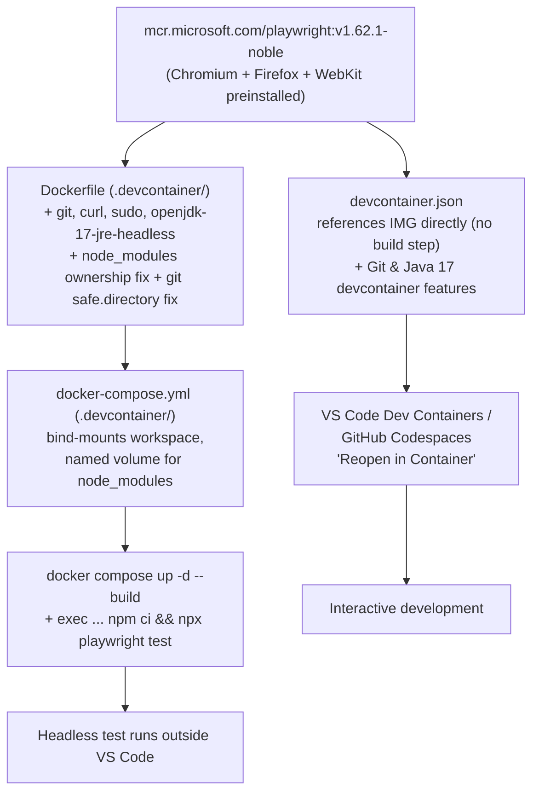

# Architecture

This document explains how `vacation-rental-automation` is put together: the layered framework
design, why the two sites need almost no per-site branching, how a test run flows from `npx
playwright test` to a diagnosable failure, and how the surrounding tooling (CI, containers,
reporting) fits around it. For _why_ each decision was made, see `README.md` → "Design decisions" —
this document is the structural map; the README carries the reasoning and the confirmed live-site
findings behind it.

## 1. Layered overview

Four layers, each only aware of the one below it. Tests never touch a `Locator` directly; page
objects never touch `expect()`; only `src/config/sites.ts` knows the two sites are actually
different.



**Why this shape:** every spec in `tests/` is written once and runs against both sites because
Playwright `projects` (see §3) inject a different `siteConfig` + `baseURL` per run - the spec
itself never branches on which site it's talking to.

## 2. Page objects and components (class relationships)



`NavComponent` is the one class with an internal branch (`site.navStyle === 'destinationDropdown'
? ... : ...`) - a Template Method via composition rather than two subclassed page objects, because
it's the only place the two sites' _interaction pattern_ (not just copy) genuinely diverges: a
"Destinations" popover on Alice vs. category pill tabs on Firesky.

## 3. Multi-site strategy: one spec, a site × browser grid of Playwright projects



Adding a third site is a new `SiteConfig` entry in `sites.ts`; adding a browser is a one-line
addition to the `browsers` array - no new test files, and (per the confirmed platform-parity
findings in the README) usually no new selectors either.

## 4. A test run, end to end (TC2 example)



## 5. Failure diagnostics pipeline



`demo-intentional-failure.spec.ts` exists solely to exercise this whole pipeline on demand - it's
excluded from CI (see §6) and kept out of the `tc*` naming so it's never mistaken for a real
product bug.

## 6. CI pipeline (`.github/workflows/playwright.yml`)



## 7. Containerization

Two entry points into the same `.devcontainer/` image, one image definition:



Both paths pin the same base image tag on purpose - "works in the dev container" and "works in
CI" (§6 runs the job in that same image via `container:`, installing Node/Java into it) mean the
same Node/browser/OS-dependency versions where it matters (the browsers), with no separate
image-build step in CI beyond `npm ci`.

## 8. Directory reference

```
vacation-rental-automation/
├── src/
│   ├── config/
│   │   └── sites.ts                    # SiteConfig type + the two site entries - the only place
│   │                                    # the sites' known differences live
│   ├── fixtures/
│   │   └── base.fixture.ts             # test.extend(): siteConfig + pre-wired page objects,
│   │                                    # keyed by the Playwright project's `site` option
│   ├── pages/
│   │   ├── BasePage.ts                 # shared open() / settleOverlays() / footer
│   │   ├── HomePage.ts                 # + SearchWidgetComponent, NavComponent, FooterComponent
│   │   ├── SearchResultsPage.ts        # /listings: filters, sort, result grid
│   │   ├── PropertyDetailsPage.ts      # /listings/{id}: schema.org JSON-LD + booking widget
│   │   ├── ListWithUsPage.ts           # /list-with-us: form + inline validation
│   │   └── components/
│   │       ├── SearchWidgetComponent.ts  # destination -> dates -> guests -> submit,
│   │       │                              # handles the auto-open/close quirks
│   │       ├── NavComponent.ts           # destinationDropdown vs. categoryPills branch
│   │       └── FooterComponent.ts        # social-link discovery by domain match
│   └── utils/
│       ├── dates.ts                    # futureStayDates() - dynamic check-in/out
│       ├── overlays.ts                 # settleOverlays() - dismiss the marketing popup + cookies
│       └── screenshot.ts               # withHighlight() / attachFailureHighlight()
│
├── tests/
│   ├── tc1-social-links.spec.ts        # TC1
│   ├── tc2-search-filter-sort.spec.ts  # TC2
│   ├── tc3-property-details.spec.ts    # TC3
│   ├── tc4-navigation.spec.ts          # TC4
│   ├── tc5-form-validation.spec.ts     # TC5
│   ├── tc6-guest-capacity.spec.ts      # bonus - run against both projects, same as TC1-5
│   └── demo-intentional-failure.spec.ts  # deliberate failure - excluded from CI (see §6)
│
├── .claude/skills/
│   ├── add-test-scenario/SKILL.md      # project-specific: how to add a new TC here
│   └── playwright-cli/SKILL.md         # generic @playwright/cli reference + references/
│
├── .devcontainer/                      # devcontainer.json + Dockerfile + docker-compose.yml
│                                        # (see §7 and DEVCONTAINER.md)
├── .github/
│   ├── workflows/
│   │   └── playwright.yml              # CI (see §6)
│   ├── test_spec/                      # TC1-TC6 written specs (manual test-case docs)
│   └── PULL_REQUEST_TEMPLATE.md        # PR checklist: scope, local test runs, docs updated
│
├── docs/
│   ├── ARCHITECTURE.md                 # this file
│   └── adding-new-sites/README.md      # step-by-step guide for adding a new site
│
├── playwright.config.ts                # the site × browser project grid, reporters, timeouts/retries/workers
├── package.json / package-lock.json    # scripts, pinned devDependency versions
├── tsconfig.json                       # strict TS, `@src/*` / `@tests/*` path aliases
├── eslint.config.js / .prettierrc.json # lint/format rules enforced by Husky's pre-commit hook
├── .mcp.json                           # Playwright MCP server (dev aid, not part of the suite)
└── README.md                           # setup, usage, design rationale, assumptions/trade-offs
```
